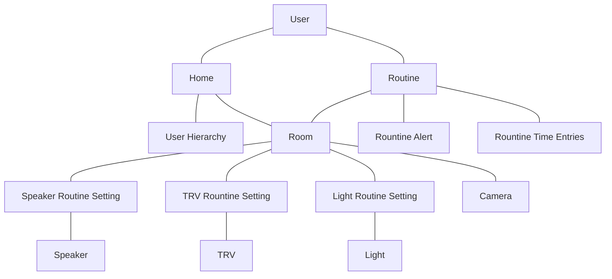

# jarvis

## Domain Model


  ## ERD
```mermaid
erDiagram
    USER ||--|| HOME : partOf
    USER {
        int user_id
        string first_name
        string last_name
        string email
    }
    HOME ||--|| USER_HIERARCHY : hasA
    HOME {
        int home_id
        int admin_id
    }
    USER_HIERARCHY {
        int home_id
        list user_order
    }
    HOME ||--|{ ROOM : inside
    ROOM{
        int room_id
        int home_id
        int routine_id
        int camera_id
    }
    ROUTINE ||--|{ ROOM
    ROUTINE {
        int routine_id
        int user_id
        time start_time
        time end_time
    }
    USER ||--|{ ROUTINE
    ROOM ||--0{ SPEAKER_ROUTINE_SETTING
    SPEAKER_ROUTINE_SETTING {
        int speaker_routine_id
        int speaker_id
        int routine_id
        string media_url
    }
    ROOM ||--0{ TRV_ROUTINE_SETTING
    TRV_ROUTINE_SETTING {
        int trv_routine_id
        int trv_id
        int routine_id
        double temperature
    }


    
```
