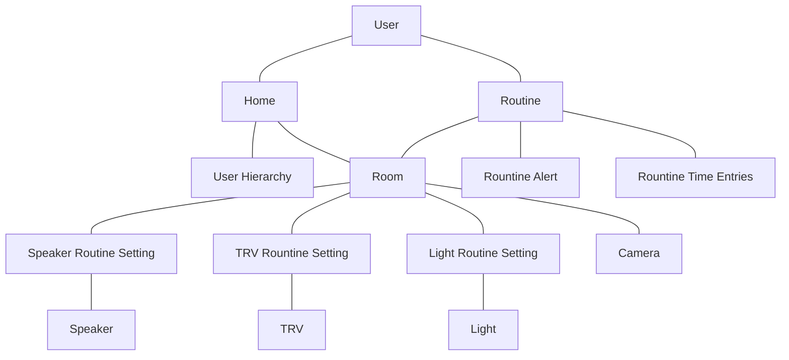

# jarvis

## Domain Model

```mermaid
graph TD
    A[User] --- B[Home]
    A --- D[Routine]
    B --- C[User Hierarchy]
    B --- F[Room]
    D --- E[Rountine Alert]
    D --- F
    D --- N[Rountine Time Entries]
    F --- G[Speaker Routine Setting]
    F --- H[TRV Rountine Setting]
    F --- I[Light Routine Setting]
    F --- M[Camera]
    G --- L[Speaker]
    H --- K[TRV]
    I --- J[Light]
```
