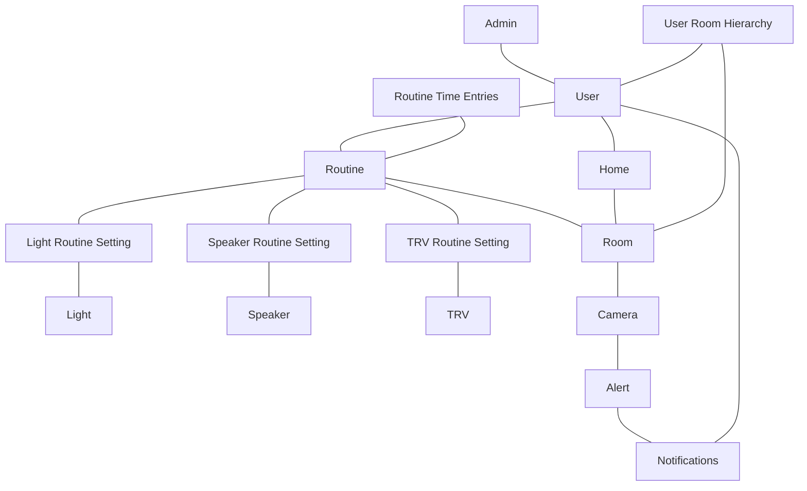
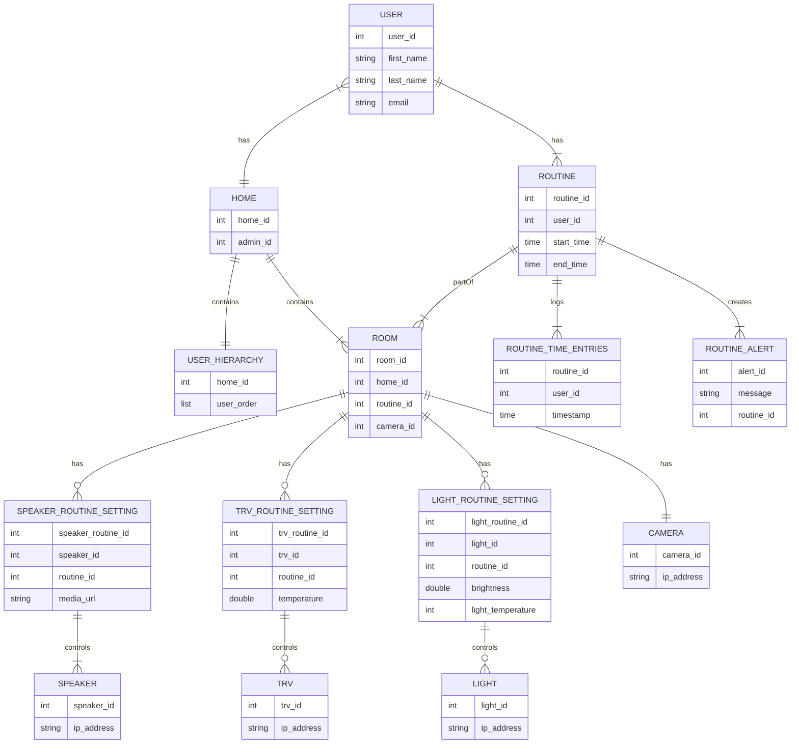

# jarvis

## Domain Model

```mermaid
graph TD
    A[Admin] --- B[User]
    B --- D[Routine]
    D --- E[Room]
    D --- F[Light Routine Setting]
    D --- G[Speaker Routine Setting]
    D --- H[TRV Routine Setting]
    F --- I[Light]
    G --- J[Speaker]
    H --- K[TRV]
    E --- L[Camera]
    M[Home] --- E
    L --- N[Alert]
    N --- O[Notifications]
    O --- B
    B --- M
    P[User Room Hierarchy] --- E
    Q[Routine Time Entries] --- D
    P --- B
```

  ## ERD

```mermaid
erDiagram
    USER }|--|| HOME : has
    USER {
        int user_id
        string first_name
        string last_name
        string email
    }
    HOME ||--|| USER_HIERARCHY : contains
    HOME {
        int home_id
        int admin_id
    }
    USER_HIERARCHY {
        int home_id
        list user_order
    }
    HOME ||--|{ ROOM : contains
    ROOM {
        int room_id
        int home_id
        int routine_id
        int camera_id
    }
    ROUTINE ||--|{ ROOM : partOf
    ROUTINE {
        int routine_id
        int user_id
        time start_time
        time end_time
    }
    USER ||--|{ ROUTINE : has

    ROOM ||--o{ SPEAKER_ROUTINE_SETTING : has
    SPEAKER_ROUTINE_SETTING {
        int speaker_routine_id
        int speaker_id
        int routine_id
        string media_url
    }
    ROOM ||--o{ TRV_ROUTINE_SETTING : has
    TRV_ROUTINE_SETTING {
        int trv_routine_id
        int trv_id
        int routine_id
        double temperature
    }
    ROOM ||--o{ LIGHT_ROUTINE_SETTING : has
    LIGHT_ROUTINE_SETTING {
        int light_routine_id
        int light_id
        int routine_id
        double brightness
        int light_temperature
    }
    SPEAKER_ROUTINE_SETTING ||--|{ SPEAKER : controls
    SPEAKER {
        int speaker_id
        string ip_address
    }
    TRV_ROUTINE_SETTING ||--o{ TRV : controls
    TRV {
        int trv_id
        string ip_address
    }
    LIGHT_ROUTINE_SETTING ||--o{ LIGHT : controls
    LIGHT {
        int light_id
        string ip_address
    }
    ROOM ||--|| CAMERA : has
    CAMERA {
        int camera_id
        string ip_address
    }
    ROUTINE ||--|{ ROUTINE_TIME_ENTRIES : logs
    ROUTINE_TIME_ENTRIES {
        int routine_id
        int user_id
        time timestamp
    }
    ROUTINE ||--|{ ROUTINE_ALERT : creates
    ROUTINE_ALERT {
        int alert_id
        string message
        int routine_id
    }

    
```
