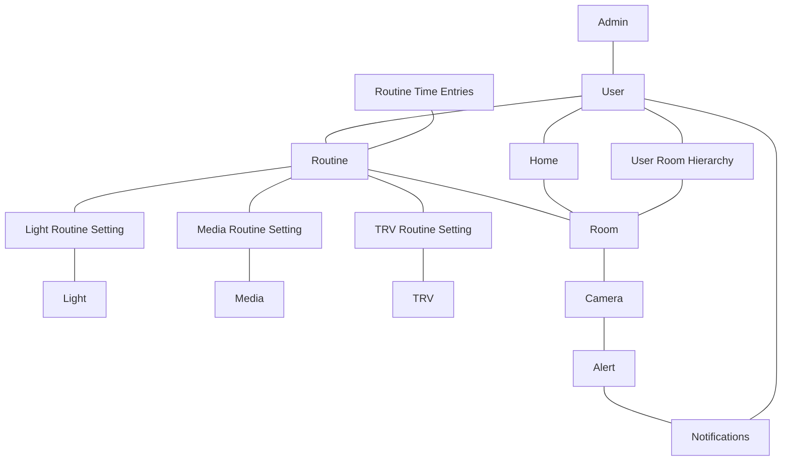
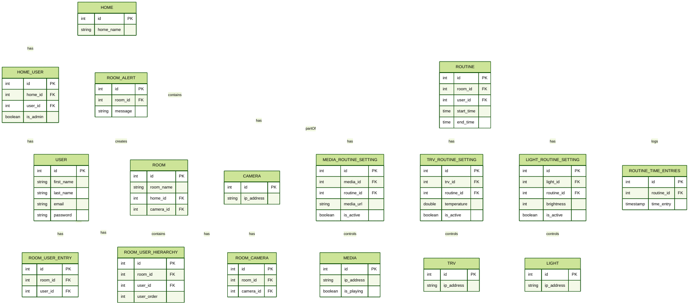

# jarvis

## Domain Model

```mermaid
graph TD
    A[Admin] --- B[User]
    B --- D[Routine]
    B --- P
    D --- E[Room]
    D --- F[Light Routine Setting]
    D --- G[Media Routine Setting]
    D --- H[TRV Routine Setting]
    F --- I[Light]
    G --- J[Media]
    H --- K[TRV]
    E --- L[Camera]
    M[Home] --- E
    L --- N[Alert]
    N --- O[Notifications]
    O --- B
    B --- M
    P[User Room Hierarchy] --- E
    Q[Routine Time Entries] --- D
```

  ## ERD

```mermaid
%%{init: {'theme': 'forest', 'themeVariables': { 'lineColor': 'white'}}}%%
erDiagram
    USER {
        int id PK
        string first_name
        string last_name
        string email
        string password
    }
    HOME {
        int id PK
        string home_name
    }
    HOME_USER {
        int id PK
        int home_id FK
        int user_id FK
        boolean is_admin
    }
    ROOM_USER_HIERARCHY {
        int id PK
        int room_id FK
        int user_id FK
        int user_order
    }
    ROOM {
        int id PK
        string room_name
        int home_id FK
        int camera_id FK
    }
    
    ROUTINE {
        int id PK
        int room_id FK
        int user_id FK
        time start_time
        time end_time
    }
    MEDIA_ROUTINE_SETTING {
        int id PK
        int media_id FK
        int routine_id FK
        string media_url
        boolean is_active
    }
    TRV_ROUTINE_SETTING {
        int id PK
        int trv_id FK
        int routine_id FK
        double temperature
        boolean is_active
    }
    LIGHT_ROUTINE_SETTING {
        int id PK
        int light_id FK
        int routine_id FK
        int brightness
        boolean is_active
    }
    MEDIA {
        int id PK
        string ip_address
        boolean is_playing
    }
    TRV {
        int id PK
        string ip_address
    }
    LIGHT {
        int id PK
        string ip_address
    }
    CAMERA {
        int id PK
        string ip_address
    }
    ROUTINE_TIME_ENTRIES {
        int id PK
        int routine_id FK
        timestamp time_entry
    }
    ROOM_ALERT {
        int id PK
        int room_id FK
        string message
        
    }
    ROOM_CAMERA {
        int id PK
        int room_id FK
        int camera_id FK

    }
    ROOM_USER_ENTRY {
        int id PK
        int room_id FK
        int user_id FK
    }
    HOME ||--|{ HOME_USER : has
    ROOM_ALERT }|--|| ROOM : creates
    ROOM ||--|| ROOM_USER_ENTRY : has
    USER ||--|| ROOM_USER_ENTRY : has
    ROOM ||--|{ ROOM_CAMERA : has
    CAMERA ||--|| ROOM_CAMERA : has
    HOME_USER }|--|| USER : has
    USER ||--|{ ROOM_USER_HIERARCHY : has
    
    ROOM ||--|{ ROOM_USER_HIERARCHY : contains
    
    HOME ||--|{ ROOM : contains 
    
    ROUTINE }|--|| ROOM : partOf
    ROUTINE ||--|| MEDIA_ROUTINE_SETTING : has 
    ROUTINE ||--|| TRV_ROUTINE_SETTING : has  
    ROUTINE ||--|| LIGHT_ROUTINE_SETTING : has  
    ROUTINE }|--|| USER : has
    
    MEDIA_ROUTINE_SETTING }|--|| MEDIA : controls  
    TRV_ROUTINE_SETTING }|--|| TRV : controls  
    LIGHT_ROUTINE_SETTING }|--|| LIGHT : controls  
      
    ROUTINE ||--|{ ROUTINE_TIME_ENTRIES : logs 
    
    
```
