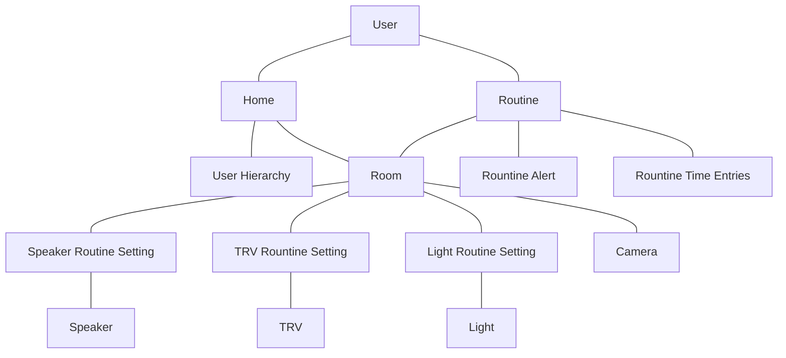

# jarvis

## Domain Model


  ## ERD
```mermaid
erDiagram
    USER }|--|| HOME : has
    USER {
        int user_id
        string first_name
        string last_name
        string email
    }
    HOME ||--|| USER_HIERARCHY : contains
    HOME {
        int home_id
        int admin_id
    }
    USER_HIERARCHY {
        int home_id
        list user_order
    }
    HOME ||--|{ ROOM : contains
    ROOM{
        int room_id
        int home_id
        int routine_id
        int camera_id
    }
    ROUTINE ||--|{ ROOM : part
    ROUTINE {
        int routine_id
        int user_id
        time start_time
        time end_time
    }
    USER ||--|{ ROUTINE : has
    ROOM ||--0{ SPEAKER_ROUTINE_SETTING : has
    SPEAKER_ROUTINE_SETTING {
        int speaker_routine_id
        int speaker_id
        int routine_id
        string media_url
    }
    ROOM ||--0{ TRV_ROUTINE_SETTING : has
    TRV_ROUTINE_SETTING {
        int trv_routine_id
        int trv_id
        int routine_id
        double temperature
    }
    ROOM ||--0{ LIGHT_ROUTINE_SETTING : has
    LIGHT_ROUTINE_SETTING {
        int light_routine_id
        int light_id
        int routine_id
        double brightness
        int light_temperature
    }
    SPEAKER_ROUTINE_SETTING ||--|{ SPEAKER : controls
    SPEAKER {
        int speaker_id
        string ip_address
    }
    TRV_ROUTINE_SETTING ||--0{ TRV : controls
    TRV {
        int trv_id
        string ip_address
    }
    LIGHT_ROUTINE_SETTING ||--0{ LIGHT : controls
    LIGHT{
        int light_id
        string ip_address
    }
    ROOM ||--|| CAMERA : has
    CAMERA{
        int camera_id
        string ip_address
    }
    ROUTINE ||--|{ ROUTINE_TIME_ENTRIES : logs
    ROUTINE_TIME_ENTRIES{
        int routine_id
        int user_id
        time/date timestamp
    }
    ROUTINE ||--|{ ROUTINE_ALERT : creates
    ROUTINE_ALERT{
        int alert_id
        string message
        int routine_id
    }

    
```
